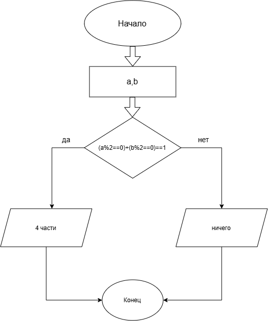

# Условие
Друзья заказали пиццу. Они решат, резать ее на 4 или 6 кусков, по простому правилу: если ровно один из них (Ваня A или Петя B) проголодался 
(его "уровень голода" - четное число), то резать на 4 части. Запишите условие для нарезки на 4 части.

# Алгоритм 
1. Начало программы.
2. Ввод уровня голода Вани a Пети b
3. Проверить условие 
4. Если условие истинно, пиццу необходимо разрезать на 4 части
5. Если условие ложно, пиццу необходимо разрезать на 6 частей
6. Вывод результатов.
7. Конец программы.
# Блок-схема

# Реализация
```c
#define _CRT_SECURE_NO_DEPRECATE
#include <stdlib.h>
#include <stdio.h>
#include <locale.h>	
int main() {
    setlocale(LC_ALL, ".UTF8");
    int a, b;
    printf("Уровень голода Вани ");
    scanf("%d", &a);
    printf("Уровень голода Пети ");
    scanf("%d", &b);
    printf("Условие для 4 частей: %d\n",(a%2)==0+(b%2==0)==1);
    system("pause");
    return 0;
}
```
# Результат работы 
```
a=1
b=2
условие для 4 частей выполняется => 1
 
```
# Информация о разработчике 
Баранов Игорь бОТИ-262

